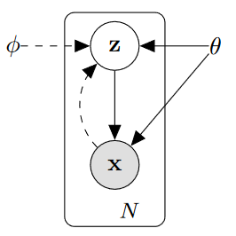
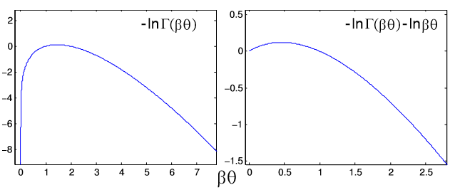
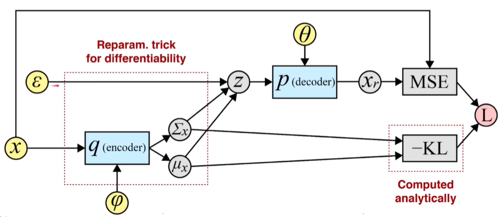

  
    VAE论文笔记
  

 

论文连接：http://arxiv.org/abs/1312.6114
目录：
  1. 模型假设
  2. 损失函数
  3. 优化算法
  4. VAE 模型
  5. 代码
 

# 模型假设
VAE模型做了如下的假设：设数据集 ${ X=\{ x^{(i)} \}^N_{i=1} }$ 是对真实分布进行独立同分布采样的结果。这些数据的生成包含两个步骤：
  1. 从一个先验分布 ${p_{\theta^*}(z)}$ 生成隐变量 ${z^{(i)}}$
  2. 根据隐变量从一个条件分布 ${p_{\theta^*}(x|z)}$ 生成 ${x^{(i)}}$

数学上描述为：
$${p_\theta(x) = \int{p_{\theta}(x|z)}p_{\theta}(z)dz}$$

我们希望能构建参数模型 ${p_{\theta}(z)}$ 与 ${p_{\theta}(x|z)}$ 以拟合两个分布。其中的隐变量的概率分布 ${p_{\theta}(z)}$ 无法直接获得，我们引入一个模型 ${\phi}$，它利用数据集由条件概率得到隐变量的近似分布 ${q_{\phi}(z|x){\cong}p_{\theta}(z|x)=p_\theta(z)}$，我们通常称其为 encoder；而后续由隐变量生成数据的过程 ${p_{\theta}(x|z)}$ 则由模型 ${\theta}$ 完成，称为 decoder.

   

# 损失函数
对生成模型 decoder，由对数极大似然，我们优化的对象为 ${\log{ p_\theta(x^{(i)}, ... , x^{(N)}) } = \sum_{i=1}^N{\log{p_\theta (x^{(i)})}}}$，其中根据 KL 散度的定义可以得到 ${\log{p_\theta (x)}}$：

$$\begin{aligned}
D_{KL}(q_\phi(z|x)||p_\theta(z|x)) 
&:= -\sum_zq_\phi(z|x)\log{\left(\frac{p_\theta(z|x)}{q_\phi(z|x)}\right)}
\\
&= -\sum_z q_\phi(z|x) \log{\left(\frac{\frac{p_\theta(x, z)}{p_\theta(x)}}{q_\phi(z|x)}\right)}
\\
&= -\sum_z q_\phi(z|x) \left[\log{\left(\frac{p_\theta(x, z)}{q_\phi(z|x)}\right)}-\log{p_\theta(x)}\right]
\\
&= -\sum_z q_\phi(z|x) \log{\left(\frac{p_\theta(x, z)}{q_\phi(z|x)}\right)} + \log{p_\theta(x)}
\end{aligned}$$

从而得到对数似然函数 ${\log{p_\theta (x)}}$ 表达式。根据 KL 散度非负，我们可以得到它的一个下界：

$$\begin{aligned}
\log p_\theta(x)
&= D_{KL}(q_\phi(z|x)||p_\theta(z|x)) + \sum_z q_\phi(z|x) \log{\left(\frac{p_\theta(x, z)}{q_\phi(z|x)}\right)}
\\
&\ge \mathcal{L}(\theta,\phi; x) 
= \mathbb{E}_{q_\phi(z|x)} \left[ -\log q_\phi(z|x) + \log p_\theta(x, z) \right]
\end{aligned}$$

其中 ${\mathcal{L}(\theta,\phi; x) }$ 即为其变分下界 ${(variational\ lower\ bound)}$，其可进一步化简：

$$\begin{aligned}
\mathcal{L}(\theta,\phi; x) 
&= \sum_z q_\phi(z|x) \log{\left(\frac{p_\theta(x, z)}{q_\phi(z|x)}\right)}
\\
&= \sum_z q_\phi(z|x) \log{\left(\frac{p_\theta(x|z)p_\theta(z)}{q_\phi(z|x)}\right)}
\\
&=\sum_z q_\phi(z|x) \left[\log\left(p_\theta(x|z)\right)+\log{\left(\frac{p_\theta(x)}{q_\phi(z|x)}\right)}\right]
\\
&= E_{q_\phi(x|z)}\left[\log\left(p_\theta(x|z)\right)\right] - D_{KL}(q_\phi(z|x)||p_\theta(z))
\end{aligned}$$

上式第一项表示的含义为：对神经网络的分布 ${q_\phi}$, 我们希望它的条件 ${z}$ 下的预测 ${x}$ 能够使实际的条件分布 ${p_\theta(\cdot|z)}$ 尽可能大，也即希望给定隐变量 ${z}$，神经网络预测的数据能够与实际隐空间所得数据相近。

上式第二项表示的含义为：我们通过数据集中的数据所推测得到的隐空间分布 ${q_\phi(z|x)}$ 能够与真实隐空间的先验概率分布 ${p_\theta(z)}$ 相近。

VAE 模型对应的是一个对数似然函数的极大值问题，我们通过构造一个下界，将其损失函数进行了化简，将优化问题转为该变分下界的极大值问题。后续的优化目标也仅需关注该变分下界即可。

# 优化算法

## 蒙特卡洛梯度法

蒙特卡洛梯度法简称 NMCGE ${(naive\ Monte\ Carlo\ gradient\ estimator)}$，它直接对我们所构造的含参模型求导：

$$\begin{aligned}
\eta
= \nabla_\phi \mathbb{E}_{q_\phi (z)}[f(z)]
&= \nabla_\phi \mathbb{E}_{q(z; \phi)}[f(z)]
\\
&= \nabla_\phi \int{q(z; \phi)}f(z) dz
\\
&= \int{f(z) \nabla_\phi q(z; \phi)} dz
\end{aligned}$$

由于：

$${
  \nabla_\phi \log q(z; \phi) 
  = \frac{\nabla_\phi q(z; \phi)}{q(z; \phi)}
}$$

因此：

$$\begin{aligned}
\eta
&= \int{q(z; \phi) f(z) \nabla_\phi \log q(z; \phi)} dz
\\
&= \mathbb{E}_{q(z; \phi)}\left[f(z) \nabla_\phi \log q(z; \phi)\right]
\end{aligned}$$

对于蒙特卡洛法所采样到的 ${N}$ 个样本，该期望的良好近似为：

$${
  \bar{\eta}_N = \frac{1}{N} \sum_{n=1}^{N} f(z^{(i)}) \nabla_\phi \log q(z^{(i)}; \phi);~~~~z^{(i)}\sim q(z; \phi)
}$$

但该优化方法的问题为 $"very\ high\ variance"$，即如下图左图所示，该算法的收敛性有一定问题，因此 VAE 模型实际采用的优化算法为另一种方法，也即即将介绍的 SGVB.

   

## 随机梯度变分贝叶斯法

随机梯度变分贝叶斯法简称 SGVB ${(Stochastic\ Gradient\ Variatianal\ Bayes)}$，其中需要首先介绍参数重整化技巧 ${(Reparamterization\ Trick)}$。

对前述所提到的隐变量随机函数分布 ${z\sim q_\phi(z|x)}$，我们可以将其的所有随机性由一个简单的随机函数 ${\epsilon \sim p(\epsilon)}$ 来表示，因此原来的隐变量分布可以通过一个函数变化由这个简单的随机函数描述：${z = g_\phi (\epsilon, x)}$，这就是参数重整化技巧。

通过参数重整化，原有的损失函数中的期望则可以化为：

$$\begin{aligned}
\eta
&= \nabla_\phi \mathbb{E}_{q_\phi (z)}[f(z)]
\\
&= \nabla_\phi \mathbb{E}_{p(\epsilon)}[f(g_\phi (\epsilon, x))]
\\
&= \mathbb{E}_{p(\epsilon)}[\nabla_\phi f(g_\phi (\epsilon, x))]
\\
&\approx \frac{1}{L} \sum^L _{l=1} \nabla_\phi f(g_\phi (\epsilon^{(l)}, x))
\end{aligned}$$

因此在求梯度的时候，只需要对我们所构造的函数 ${g}$ 进行梯度求解即可。

损失函数最后可表示为：

$$\begin{aligned}
\mathcal{L}(\theta, \phi; x^{(i)}) = - D_{KL}(q_\phi(z|x^{(i)})||p_\theta(z))+ \frac{1}{L} \sum^L _{l=1} \log p_\theta (x^{(i)}|z^{(i, l)})
\\
where~~~~z^{(i, l)} = g_\phi (\epsilon^{(i, l)}, x^{(i)})
~~~~and~~~~
\epsilon^{(i)}\sim p(\epsilon)
\end{aligned}$$

若给定总共含 ${N}$ 个数据点的数据集 ${X}$，则对随机选择的 ${M}$ 个数据，损失函数的估计值为：

$$\begin{aligned}
\mathcal{L}(\theta, \phi; X) \simeq \tilde{\mathcal{L}}^M(\theta, \phi; X^M)
= \frac{N}{M}\sum^M _{i=1} \tilde{\mathcal{L}}(\theta, \phi; x^{(i)})
\end{aligned}$$

# VAE 模型

通常情况下，为了计算方便，我们会假设隐变量的随机分布为高斯分布（正态分布），此时损失函数中的 **KL 散度项**可做进一步化简：

$$\begin{aligned}
D_{KL}(q_\phi(z|x)||p_\theta(z))
&= \int{q_\phi(z|x) \left[\log{\left(\frac{p_\theta(x)}{q_\phi(z|x)}\right)}\right]}dz
\\
&= \int{q_\theta(z|x) \log p(z) - q_\theta(z|x) \log q_\phi (z|x)} dz
\end{aligned}$$

其中，若设 ${J}$ 为隐变量 ${z}$ 的维数，则等式右两项分别化简为：

$$\begin{aligned}
\int{q_\theta(z|x) \log p(z)} dz
&= \int{N(z; \mu, \sigma^2) \log N(z; 0, I)} dz
\\
&= \int{N(z; \mu, \sigma^2) \left(-\frac{1}{2}z^2 - \frac{1}{2}\log (2\pi)\right)} dz
\\
&= -\frac{1}{2}\int{N(z; \mu, \sigma^2) z^2} dz - \frac{J}{2} \log (2\pi)
\\
&= - \frac{J}{2} \log (2\pi) - \frac{1}{2} \mathbb{E}_{z \sim N(z; \mu, \sigma^2)} [z^2]
\\
&= - \frac{J}{2} \log (2\pi) - \frac{1}{2} \left(\mathbb{E}_ {z \sim N(z; \mu, \sigma^2)} [z]^2+Var(z)\right)
\\
&= - \frac{J}{2} \log (2\pi) - \frac{1}{2} \sum^J _{j=1} (\mu_j^2+\sigma_j^2)
\end{aligned}$$

$$\begin{aligned}
\int{ q_\theta(z|x) \log q_\phi (z|x)} dz
&= \int{N(z; \mu, \sigma^2) \log N(z; \mu, \sigma^2)} dz
\\
&= \int{N(z; \mu, \sigma^2) \left(-\frac{1}{2}(\frac{z-\mu}{\sigma})^2 - \frac{1}{2}\log (2\pi) - \frac{1}{2}\log (\sigma^2) \right)} dz
\\
&= -\frac{1}{2}\int{N(z; \mu, \sigma^2) (\frac{z-\mu}{\sigma})^2} dz - \frac{J}{2} \log (2\pi) - \frac{1}{2}\sum^J _{j=1} \log (\sigma_j^2)
\\
&= - \frac{J}{2} \log (2\pi) - \frac{1}{2}\sum^J _{j=1} \log (\sigma_j^2) - \frac{1}{2} \mathbb{E}_{z \sim N(z; \mu, \sigma^2)} [(\frac{z-\mu}{\sigma})^2]
\\
&= - \frac{J}{2} \log (2\pi) - \frac{1}{2}\sum^J _{j=1} \log (\sigma_j^2) - \frac{1}{2} \left(\mathbb{E}_ {z \sim N(z; \mu, \sigma^2)} [\frac{z-\mu}{\sigma}]^2+Var(\frac{z-\mu}{\sigma})\right)
\\
&= - \frac{J}{2} \log (2\pi) - \frac{1}{2} \sum^J _{j=1} (1 + \log (\sigma_j^2))
\end{aligned}$$

从而可得

$$\begin{aligned}
D_{KL}(q_\phi(z|x)||p_\theta(z))
&= \int{\left[q_\theta(z|x) \log p(z) - q_\theta(z|x) \log q_\phi (z|x)\right]} dz
\\
&= \frac{1}{2} \sum^J_{j=1} (1 + \log \sigma_j^2 - \mu_j^2 - \sigma_j^2)
\end{aligned}$$

而对损失函数中的**期望值项**，则由均方误差函数 MSE 进行重构误差的计算即可得到。

因此，VAE 的整体模型流程图总结如下：
  1. 给定数据集中的数据点 $x$，编码器 $q_\phi$ (encoder) 将其编码为一系列均值与方差
  2. 随机生成 $\epsilon$，并通过参数重整化生成隐变量 $z$
  3. 解码器 $p_\theta$ (decoder) 将隐变量 $z$ 重构为初始数据点形式 $x_r$
  4. 根据均值与方差计算 KL 散度；根据数据点与重构结果计算重构误差 $MSE(x, x_r)$
  5. 得到损失函数，优化迭代

   

# 代码
@import "1_VAE/VAE.py"